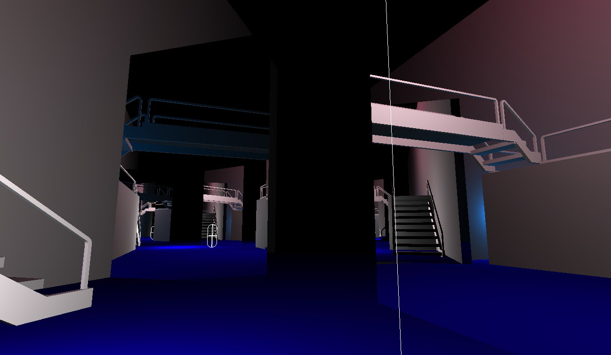
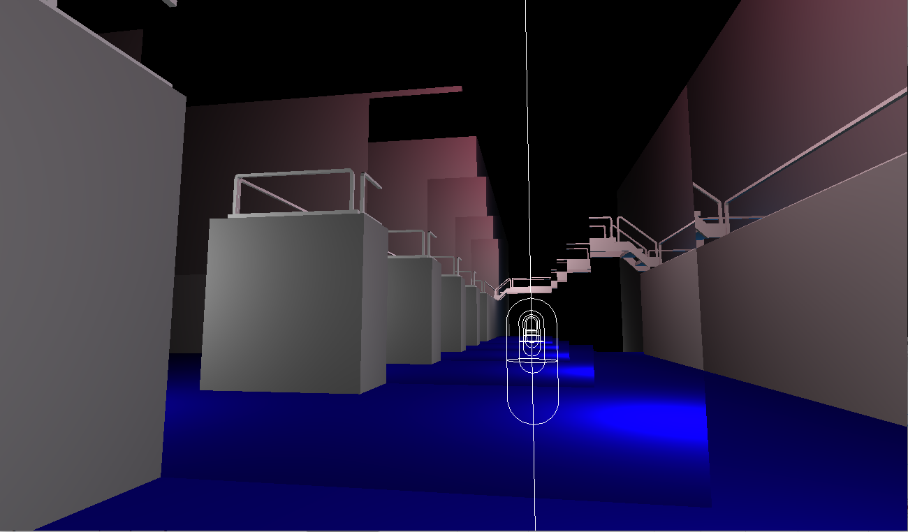
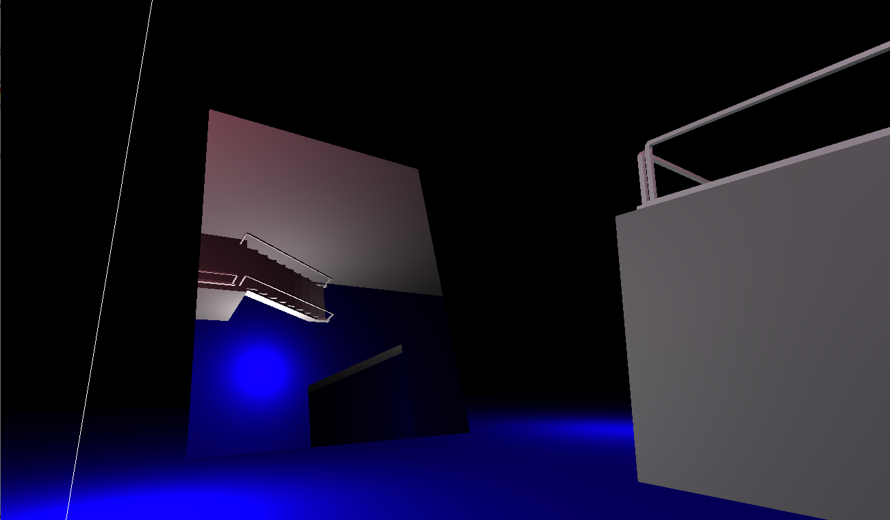

# Mayhem

## Brief

This project was at first supposed to be a first person exploration game. The player would venture through non-euclidian rooms. This effect is achieved by portals.

The project later on was shifted to be a cooperative exploration game in proceduraly generated tunnels, but it didn't go far enough to implement those funcionalities.

The renderer used in this project was also my first successful dual-threaded renderer, and it is divided in with a similar nomeclature used for DooM 3's renderer. The backend is the render thread, and deals with OpenGL stuff while the frontend does visibility computation and draw command isssuing. It also computes the proper view matrices for portals.

This project also has (at the time of writing) my best capsule/triangle mesh collision detection implementation. Collision detection happens by predicting the route the capsule will follow and using that to compute the closest point to a triangle. This removes all sorts of tunneling.

The character controller code is not properly finishes, so there are some situations where the solver will push the collider through walls while it resolves a contact.

This is one of the eariler tests of collision detection with portals

Some more tests after fixing some rendering problems with the portals

Collision detection with portals was sort of lacking. It worked right only for axis-aligned portals, although portals could be in any orientation, and would display things correctly.